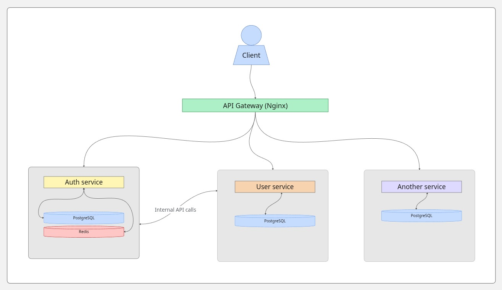

# Memo Product — Microservice Authentication and User Management
[](https://python.org)
[](https://fastapi.tiangolo.com)
[](https://python-poetry.org)
[](https://docker.com)
[](https://redis.io)
[](https://postgresql.org)
____
## **Memo Product** is an educational microservice project built with FastAPI, demonstrating authentication and user management using JWT (RS256), PostgreSQL, Redis, and an Nginx API Gateway. The project is organized as a monorepo with a shared `memo_libs` library for code reuse across services.
---
## 📐 Architecture


*Client → Nginx (API Gateway) → Auth Service / User Service*

- **API Gateway (Nginx)** — single entry point, routes requests to the appropriate microservices.
- **Auth Service** — authentication service: issues and validates JWT, stores refresh tokens in Redis and PostgreSQL.
- **User Service** — user management service: registration, data retrieval, credential verification.
- **PostgreSQL** — two separate databases (one for users, one for tokens).
- **Redis** — stores active refresh tokens for fast access and TTL control.

Internal service-to-service calls are protected by API keys.

___
## 🛠 Tech Stack

- **Python 3.12**
- **FastAPI 0.128.0** — web framework
- **Uvicorn 0.40.0** — ASGI server
- **Pydantic 2.12.5** + **Pydantic Settings 2.12.0** — data validation and settings management
- **PostgreSQL 15** + **asyncpg 0.31.0** — database and async driver
- **SQLAlchemy 2.0.46** (asyncio support) — ORM
- **Alembic 1.18.1** — database migrations
- **Redis 7** + **redis-py 7.1.0** — in-memory store
- **JWT (RS256)** — asymmetric token encryption (via `pyjwt[crypto] 2.10.1` and `python-jose[cryptography] 3.5.0`)
- **Passlib 1.7.4** (bcrypt) — password hashing
- **HTTPX 0.28.1** — async HTTP client for internal service calls
- **Nginx** — API Gateway
- **Docker** + **Docker Compose** — containerization and orchestration
- **Poetry** — dependency management
- **Pytest 9.0.2** + **pytest-asyncio 1.3.0** — testing
- **Black 26.1.0** — code formatting
- **Logging** — unified logging configuration via `memo_libs`

---

## 📁 Project Structure (Monorepo)
```
memo_product/
├── memo_libs/ # Shared library for microservices
│ ├── clients/ # HTTP clients for inter-service communication
│ ├── database/ # Base database classes (engine, sessions)
│ ├── exceptions/ # Common exceptions
│ ├── logging/ # Logging configuration
│ ├── security/ # Security utilities (currently empty)
│ └── settings/ # Base Pydantic settings
├── services/
│ ├── auth_service/ # Authentication microservice
│ │ ├── app/
│ │ │ ├── api/ # Endpoints
│ │ │ ├── core/ # Configuration, security
│ │ │ ├── models/ # SQLAlchemy + Redis models
│ │ │ ├── schemas/ # Pydantic schemas
│ │ │ └── utils/ # JWT utilities
│ │ ├── alembic/ # DB migrations
│ │ ├── tests/
│ │ ├── docker-compose.yml # Local compose for the service (if needed)
│ │ ├── Dockerfile
│ │ └── .env.template
│ └── user_service/ # User management microservice
│ ├── app/
│ │ ├── api/
│ │ ├── business_logic/
│ │ ├── core/
│ │ ├── crud/
│ │ ├── models/
│ │ └── schemas/
│ ├── alembic/
│ ├── tests/
│ ├── Dockerfile
│ └── .env.template
├── nginx/
│ └── nginx.conf # API Gateway configuration
├── docker-compose.yml # Main compose for the whole project
├── pyproject.toml # Common dependencies (Poetry)
├── poetry.lock
└── README.md
```
____
## ⚙️ Prerequisites

- **Docker** and **Docker Compose** (to run in containers)
- **Python 3.12** and **Poetry** (for local development)
- **make** (optional, for convenience)

___
## 🚀 Quick Start with Docker Compose

1. **Clone the repository:**
   ```bash
   git clone https://github.com/FernandoProd/memo_product.git
   cd memo_product
   ```
   
2. Create `.env` files for each service from the templates:
    ```bash
    cp services/auth_service/.env.template services/auth_service/.env
    cp services/user_service/.env.template services/user_service/.env
   ```
   Edit variables if needed (passwords, keys, etc.).

3. Generate an RSA key pair for JWT (if not already present):
    ```bash
    mkdir -p services/auth_service/certs
    openssl genrsa -out services/auth_service/certs/jwt-private.pem 2048
    openssl rsa -in services/auth_service/certs/jwt-private.pem -pubout -out services/auth_service/certs/jwt-public.pem
   ```
4. Start all services:
    ```bash
    docker-compose up --build
   ```
5. Verify everything is working:

- User Service Swagger: http://localhost/api/v1/users/docs
- Auth Service Swagger: http://localhost/api/v1/auth/docs
- (Nginx proxies requests to the appropriate services)

💻 Local Development (without Docker)
1. Install Poetry and dependencies
    ```bash
    pip install poetry
    poetry install
   ```
2. Set up PostgreSQL databases and Redis
- Create two databases: `user` and `auth_user` (or use Docker containers only for the databases).
- Run Redis locally.

3. Configure environment variables
Copy `.env.template` to `.env` for each service and update the URLs (e.g., use `localhost:5432` instead of container names).

4. Apply migrations
For each service, run:
    ```bash
    cd services/user_service
    alembic upgrade head

    cd ../auth_service
    alembic upgrade head
   ```
5. Start the services (in separate terminals)
    ```bash
    # Terminal 1
    cd services/user_service
    uvicorn app.main:app --reload --port 8000

    # Terminal 2
    cd services/auth_service
    uvicorn app.main:app --reload --port 8001
   ```
6. (Optional) Run Nginx locally
If you want to use the API Gateway, configure nginx with the config from `nginx/nginx.conf` and set the upstreams to `localhost:8000` and `localhost:8001`.

___
## 📬 API Endpoints
### User Service (port 8000, prefix /api/v1/users)
- `POST /` — create a new user (registration)
- `POST /verify` — verify password (internal, for auth_service)
- `GET /me` — get current user data (requires access token)
- `GET /{user_id}` — get user by ID (internal, protected by API key)

### Auth Service (port 8001, prefix /api/v1/auth)
- `POST /login` — authenticate, issue access + refresh (refresh in http‑only cookie)
- `POST /refresh` — refresh access token using refresh token from cookie
- `POST /verify_token` — validate JWT (internal)
- `POST /logout` — logout, revoke refresh token

Detailed endpoint documentation is available in Swagger UI after startup.

## 📦 Shared Library `memo_libs`
`memo_libs` contains reusable modules:

- `clients` — base HTTP client and implementations for `user_client` and `auth_client` (using `httpx.AsyncClient`).
- `database` — SQLAlchemy `Base` class, `db_helper` for managing engine and sessions.
- `exceptions` — common exceptions (e.g., for client errors).
- `logging` — unified logging configuration (format, file/console output).
- `settings` — base Pydantic settings models, extended by service‑specific configs.
This avoids code duplication and centralizes common functionality.

🧪 Testing
Each service has its own tests written with `pytest`. To run them:
```bash
    # From the project root
    pytest services/user_service/tests
    pytest services/auth_service/tests
```

📄 License
## This project is licensed under the MIT License. See the LICENSE file for details.

## Enjoy using Memo Product! 🚀